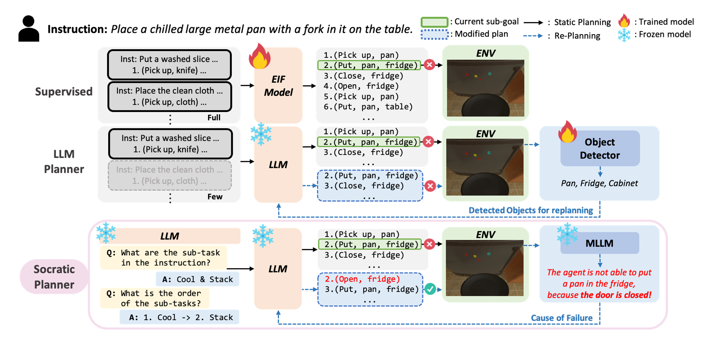

<h1 align="center">
  Socratic Planner: Self-QA-Based Zero-Shot Planning for Embodied Instruction Following
</h1>
<p align="center">
  Suyeon Shin, Sujin Jeon, Junghyun Kim, Gi-Cheon Kang, Byoung-Tak Zhang<br>
  Seoul National University
</p>
<h3 align="center">
  Published in ICRA 2025
</h3>
<p align="center">
  Code for <a href="https://arxiv.org/abs/2404.15190">Socratic-Planner</a>
</p>

<br>

## Abstract
Embodied Instruction Following (EIF) is the task of executing natural language instructions by navigating and interacting with objects in interactive environments. A key challenge in EIF is compositional task planning, typically addressed through supervised learning or few-shot in-context learning with labeled data. To this end, we introduce the Socratic Planner, a self-QA-based zero-shot planning method that infers an appropriate plan without any further training. The Socratic Planner first facilitates self-questioning and answering by the Large Language Model (LLM), which in turn helps generate a sequence of subgoals. While executing the subgoals, an embodied agent may encounter unexpected situations, such as unforeseen obstacles. The Socratic Planner then adjusts plans based on dense visual feedback through a visually-grounded re-planning mechanism. Experiments demonstrate the effectiveness of the Socratic Planner, outperforming current state-of-the-art planning models on the ALFRED benchmark across all metrics, particularly excelling in long-horizon tasks that demand complex inference. We further demonstrate its real-world applicability through deployment on a physical robot for long-horizon tasks.

## Architecture
<p align="center">
  
</p>

## Installation & Setup

1. **Install Matterport3D Simulator**
   Follow the instructions [here](https://github.com/peteanderson80/Matterport3DSimulator) to install the simulator.
   ```bash
   export PYTHONPATH=Matterport3DSimulator/build:$PYTHONPATH
   ```

2. **Create Python Environment**
   Create a Conda virtual environment with the required libraries.
   ```bash
   conda env create -f hlsm/hlsm-alfred.yml
   conda activate hlsm-alfred
   ```

3. **Set up ALFRED Source Code**
   This project requires the ALFRED simulator source code. Follow the instructions in `hlsm/README.md` to set up the `alfred_src` directory.

4. **Set Environment Variables**
   Before running any scripts, set up the necessary environment variables from your terminal.
   ```bash
   source hlsm/init.sh
   ```

5. **Set OpenAI API Key**
   To use the LLM, set your OpenAI API key as an environment variable.
   ```bash
   export OPENAI_API_KEY="sk-..."
   ```

## Data Preparation

1.  **Generate Policies and QA**: Run `make_policy/make_policy_decomposition.py` to generate policies and QA data from the LLM.
    ```bash
    python make_policy/make_policy_decomposition.py --alfred_data_path /path/to/your/alfred/data
    ```
2.  **Convert Data**: Use the `hlsm/modify_data.py` script to convert the generated raw policy text file into a structured and normalized JSON format that the agent can use.
    ```bash
    python hlsm/modify_data.py \
        --input-dir /path/to/your/raw_llm_outputs \
        --output-dir /path/to/your/processed_data \
        --mode <experiment_name> \
        --policy-file-num <file_number>
    ```
    This script will parse the raw text, normalize action and object names to match the ALFRED vocabulary, and save the final JSON file in the specified output directory. This final file can then be used with the `--policies_path` argument in the evaluation script.
    
## Execution

Run the agent in the ALFRED environment for evaluation.

### Standard Environment
```bash
python hlsm/main/rollout_and_evaluate.py alfred/eval/hlsm_full/eval_hlsm_valid_seen --policies_path /path/to/your/policies.json --qa_path /path/to/your/decomposed_qa.txt --replan
